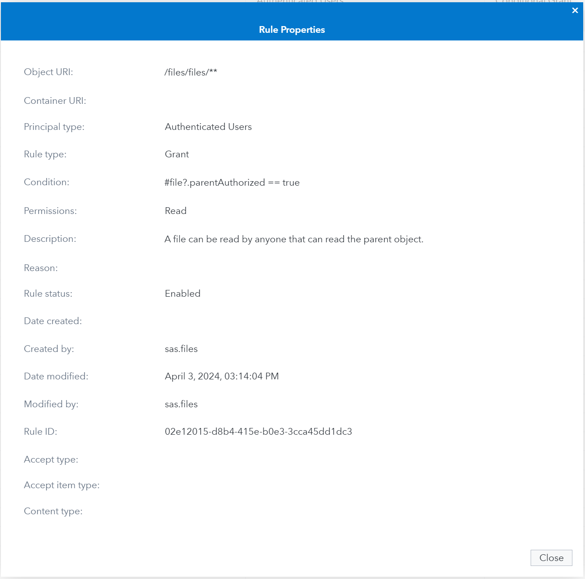

# 2. Authorization & API Interaction

In the previous section we created an OAuth client. In this process the OAuth client was granted a set of "authorities". These authorities correspond to groups within the Viya environment.

It is generally recommended to assign at least two groups to any given OAuth client, one to provide access to functionality or capabilities, and one to provide access to data and content. In our example these groups are api-users and finance-users.

Authorizing OAuth clients to access functionality, capabilities or data is therefore no different than how one would grant this access to any other group in the environment. We will see in section 4 that for some API usage additional permissions and therefore group memberships are required.

## General Authorization
In this section we will focus on the General Authorization system described in the [General Authorization](https://go.documentation.sas.com/doc/en/sasadmincdc/default/calauthzgen/p0ro419uuj1cjqn1gw2jmofmg0bn.htm) section of the SAS Viya Platform Administration guide.

The second authorization system used in the SAS Viya platform is the [CAS Authorization](https://go.documentation.sas.com/doc/en/sasadmincdc/default/calauthzcas/titlepage.htm) system. We will touch upon this authorization system section 4 as well.

The general authorization system grants is used to grant access to both functionality and capabilities as well as access to content such as files stored in the SAS Viya platform. Extensive documentation about this authorization system can be found in the link above. For this section we will just give an example of how to grant permissions to the OAuth client, via its group memberships, to functionality and content.

## Getting the content of a file

Let's say we want to access the content of a file, using the API described [here](https://developer.sas.com/rest-apis/files/getfileContentForGivenId). To access the content of a file, we need access to both the specific Files service API (/files/{fileId}/content) and the file itself.

Most APIs are available to regular users and do not require any extra permissions to be granted. The access that these APIs provide is limited by the data or content that they work on.

In the SAS Environment Manager we can see that this is the case for this particular API. Authenticated Users already have permission to read a file as long as they can read the parent object.

<center>
    
</center>

To grant access to the file, we therefore need to make sure the group Finance Users has access to the folder in which the file is contained. This can be verified on the Content pane of SAS Environment Manager:



With both of these authorizations in place, we can now use our access token retrieved in the previous session to perform our first API call:

<details>
<summary>API Call</summary>

```
INGRESS_URL=https://hostname.example.com
FILE_ID="e14a8a5c-ed1d-4ca0-9c8c-f9b7c038ca6f"

curl --request GET \
  --url "${INGRESS_URL}/files/files/${FILE_ID}/content" \
  --header 'Accept: application/vnd.sas.error+json' \
  --header "Authorization: Bearer $OAUTH_TOKEN"
```

</details>

<details>
<summary>API Response</summary>

```
proc setinit; # what else
```

</details>

This proves that our permissions granted through the General Authorization system to the Finance Users group has in turn granted the OAuth client the permission it needs to perform this operation.

## Next
In the [next](./runtimes.md) section we will cover interacting with APIs of the different SAS runtimes.


