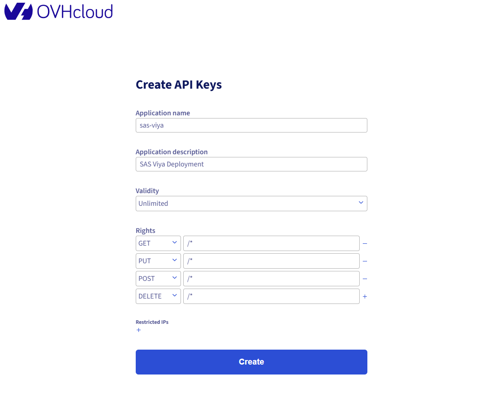

# Terraform Setup Guide

## Steps to set up Terraform with OVHcloud

### 1. Obtain the tokens

We need to start by accessing this link and creating the API Keys:
https://www.ovh.com/auth/api/createToken



Pay attention to the **Rights** section and make sure to have the `GET`, `PUT`, `POST`, `DELETE` requests set to `/*` (meaning the tokens we will get in return can be used for all the CRUD operations for all the resources).

After the creation process you will be prompted to a page which displays the following tokens: **Application Key**, **Application Secret** and **Consumer Key**. 
Save them in a secure place as there is no way of retrieving them afterwards and we will be needing them later.

### 2. Install Terraform

```sh
sudo yum install -y yum-utils
sudo yum-config-manager --add-repo https://rpm.releases.hashicorp.com/RHEL/hashicorp.repo
sudo yum -y install terraform
```

### 3. Create the Terraform environment

Now we will be creating the directory in which we will be store all the following Terraform files that will describe our infrastructure along with the new workspace that we will be using.

```
mkdir viya-terraform && cd viya-terraform
```

```
terraform workspace new viya-terraform
```

### 4. Create the provider:

Now we need to create the Terraform provider:

```
# Define providers and set versions
terraform {
required_version    = ">= 0.14.0" # Takes into account Terraform versions from 0.14.0
  required_providers {
    openstack = {
      source  = "terraform-provider-openstack/openstack"
      version = ">= 3.0.0"
    }

    ovh = {
      source  = "ovh/ovh"
      version = ">= 2.1.0"
    }
  }
}

# Configure the OpenStack provider hosted by OVHcloud
provider "openstack" {
  auth_url    = "https://auth.cloud.ovh.net/v3/" # Authentication URL
  domain_name = "default" # Domain name - Always at 'default' for OVHcloud
}

provider "ovh" {
  endpoint           = "ovh-eu"
  application_key    = "APPLICATION_KEY"
  application_secret = "APPLICATION_SECRET"
  consumer_key       = "CONSUMER_KEY"
```

### 5. Create a new OpenStack user

The OpenRC file - which is a shell script that sets environment variables in order to be able to authenticate and interact with the OpenStack APIs.

5.1. Navigate to **Project Management** > **Users & Roles** in your cloud project.

5.2. Click on **Add user**, choose a description and select the **Administrator** role and click on **Validate**.


5.3. After the user has been created, you will see a banner with the following message:

> User user-xxxxxxxxxx has been added with the password xxxxxxxxxx.

Make sure to save this password in a secure place as we will need it later.

5.4. Locate the user you had just created in the users list and go to user setting by clicking on the three dots. 

Now you just need to download the OpenStack RC's file and save it in the location of your Terraform workspace.


5.5. Run the `opensrc.sh` file and when prompted use the password we saved at Step 5.3.

```sh
source opensrc.sh
```

### 6. Initialize the Terraform workspace:

```sh
terraform init
```

### Some useful commands

To generate a read-only preview of the changes Terraform would make to align your infrastructure with your configuration:

```sh
terraform plan
```

To apply the said changes:

```sh
terraform apply
```

Delete the infrastructure:

```sh
terraform destroy
```